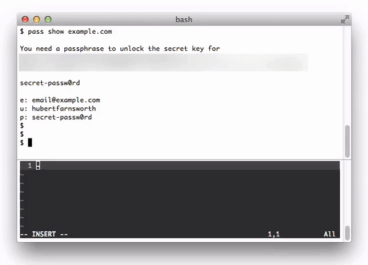

Passextract
===========

An extension to the [pass][1] password manager. Pass works very well and covers
about 95% of my needs. Its `-c` option allows passwords to be easily copied to
the clipboard. Unfortunately, email addresses and usernames cannot be so easily
copied.

Passextract provides a UI similar to [urlview][2] that enables these additional
fields to be copied to the system clipboard. Three fields are recognised:
emails, usernames, and passwords. They are defined as follows:

	This text is ignored
	
	e: email@example.com
	u: username
	p: secret-password

In order to be recognised by Passextract, those fields must be prefixed by
“e: ”, “u: ”, or “p: ” as illustrated above.

## Demo

## Usage
Passextract can be invoked on its own or with the piped output of `pass show`:

	$ pass show github.com | passextract
	
	# or
	
	$ passextract github.com

The included Bash completion file provides the same tab completion options as
`pass show`.

In the interactive UI, the following commands are available:

	q or Ctrl-C: Quit and clear the clipboard
	          j: Move the selection down
	          k: Move the selection up
	          g: Move the selection to the top
	          G: Move the selection to the bottom
	      Enter: Copy the currently selected line

## Install
A binary built for Mac OS X is available on the [releases][3] page. Download the
binary and put it in your `PATH`, then source the `passextract.bash-completion`
file.

To compile from source or install on other platforms, you'll need the [Rust][4]
compiler.

1. Install with `cargo`:

		$ cargo install --git https://github.com/teddywing/passextract.git --root /usr/local

2. Download and source the Bash completion file in your Bash profile:

		source ~/path/to/passextract.bash-completion

## Uninstall

	$ cargo uninstall --root /usr/local passextract

## License
Copyright © 2016 Teddy Wing. Licensed under the GNU GPLv3+ (see the included
COPYING file).

[1]: https://www.passwordstore.org/
[2]: https://github.com/sigpipe/urlview
[3]: https://github.com/teddywing/passextract/releases
[4]: https://www.rust-lang.org/
